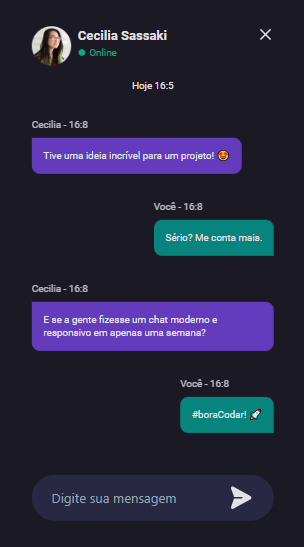

<h1 align="center"> Chat - Desafio 4 </h1>

Desafios exclusivos, promovido pela Rockeseat.  

  

 

  <h3 align='center'>Web</h3>
  

  <h3 align='center'>Mobile</h3>
  

## ✅ Status

 - Em produção ✅

## 👨🏼‍💻 Funções

 - Manipulação do scroll da tela
 - Mudança do estilo do componente de mensagens dependendo do tipo de mensagem enviada

## 🚀 Tecnologias

Esse projeto foi desenvolvido com as seguintes tecnologias:

- React
- Tailwindcss
- Styled Components
- Phosphor React
- Git e Github

## 💻 Projeto

Este projeto é o desafio 4 dos challengers semanais da Rocketseat #boraCodar

- [Acesse o projeto finalizado, online](https://responsive-chat-bora-codar.vercel.app)

## 🔖 Layout

Você pode visualizar o layout do projeto através [DESSE LINK](https://www.figma.com/file/BjOIcPvBa58FjAv7c0C1Jo/%23boraCodar---Desafio-4-(Community)). É necessário ter conta no [Figma](https://figma.com) para acessá-lo.

## :memo: Licença

Esse projeto está sob a licença MIT.
